<h1 align="center">Hey, I'm Jannik</h1>

  <b>ML Engineer</b> · Building production ML systems in healthcare

  &nbsp;
  

---

  

<h3 align="center">Tools I Work With</h3>

  
  
  
  
  

  
  
  
  
  

  
  
  
  
  

